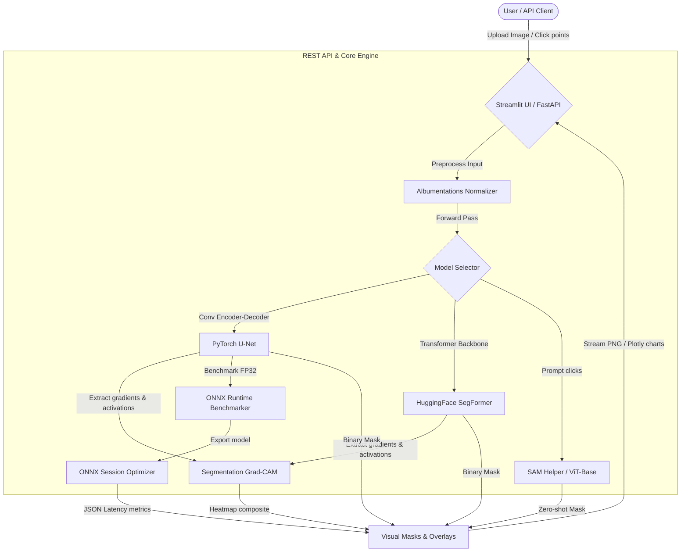

# 🖼️ VisionGuard AI: Vision Segmentation & Benchmarking Platform

[](https://github.com/portfolio-owner/VisionGuard_AI/actions/workflows/ci.yml)
[](LICENSE)
[](pyproject.toml)
[](src/utils/onnx_export.py)

VisionGuard AI is a medical image segmentation and benchmarking platform comparing classic convolutional models against vision transformers (ViT) and zero-shot foundation models. 

This repository is built as an enhanced, production-ready portfolio project extending [milesial/Pytorch-UNet](https://github.com/milesial/Pytorch-UNet) with clean engineering, modern UI/API layers, ONNX optimization, and advanced explainability.

---

## 🌟 Major Enhancements & Engineering Work

Compared to the upstream U-Net implementation, this project introduces:
1. **Multi-Model Support**: Comparative benchmarking between **U-Net** and **SegFormer** (Vision Transformer).
2. **Segment Anything (SAM) Integration**: Point-prompt interactive segmentation for zero-shot object partitioning.
3. **Model Explainability**: Built-in **Grad-CAM** hooks visualizing class activation mappings and network attention.
4. **Fast ONNX Runtime Benchmarking**: Scripts to export PyTorch models to ONNX and run speed comparisons.
5. **Interactive UI**: A dashboard built with **Streamlit** including overlay opacity sliders, click triggers, and Plotly latency graphs.
6. **Robust REST API**: **FastAPI** backend supporting predictions, SAM prompt execution, explainability maps, and latency reports.
7. **Clean Architecture**: Refactored package modularization with type hints, static configurations, Pytest suites, Ruff formatting, and Docker containerization.

---

## 📐 System Architecture



---

## 🛠️ Tech Stack

- **Deep Learning Frameworks**: PyTorch, torchvision, HuggingFace Transformers (Segformer, SAM)
- **Model Optimizations**: ONNX, ONNX Runtime
- **Explainability**: OpenCV, Grad-CAM (Custom Gradient-based hooks)
- **Data Pipelines**: NumPy, Albumentations (elastic transforms, flips, normalization)
- **APIs & Web Server**: FastAPI, Uvicorn, Pydantic, python-multipart
- **Visualization & Frontend**: Streamlit, Plotly, Pillow, Matplotlib
- **Quality Assurance**: Pytest, Pytest-Cov, Ruff, Mypy, Pre-commit

---

## 📂 Project Structure

```text
VisionGuard_AI/
├── .github/workflows/ci.yml   # Github CI Pipeline
├── app/
│   ├── api.py                 # FastAPI REST API Server
│   └── ui.py                  # Streamlit Interactive Dashboard
├── configs/
│   ├── config.yaml            # Hydra/YAML Parameters
│   └── model_card.md          # Model cards & metadata
├── src/
│   ├── __init__.py
│   ├── config.py              # YAML Configuration Loader
│   ├── data/
│   │   └── dataset.py         # Albumentations pipelines & Synthetic Generator
│   ├── models/
│   │   ├── unet.py            # U-Net PyTorch Architecture
│   │   ├── segformer.py       # SegFormer Wrapper (mit-b0)
│   │   └── sam_helper.py      # Segment Anything Model interface
│   ├── training/
│   │   ├── train.py           # Mixed precision training & WandB setup
│   │   └── eval.py            # Validation Loop
│   └── utils/
│       ├── explainability.py  # Segmentation Grad-CAM calculation
│       ├── onnx_export.py     # ONNX converter & Latency Benchmarker
│       └── dice_score.py      # Dice Loss and Metric calculators
├── tests/                     # Pytest suite
├── notebooks/
│   └── inference_demo.ipynb   # Interactive analysis notebook
├── Dockerfile                 # Multi-stage production build
├── Makefile                   # Developer shortcuts
├── requirements.txt           # PIP dependencies lockfile
└── pyproject.toml             # Python standards metadata
```

---

## 🚀 Getting Started

### Prerequisites
Install [uv](https://github.com/astral-sh/uv) or standard Python 3.9+ environment.

### 1. Installation
Using the Makefile:
```bash
make setup
```
Or via standard pip:
```bash
pip install -r requirements.txt
```

### 2. Running the API Backend
```bash
make run-api
```
The interactive Swagger API documentation will be available at [http://localhost:8000/docs](http://localhost:8000/docs).

### 3. Running the Streamlit Dashboard
```bash
make run-ui
```
Open [http://localhost:8501](http://localhost:8501) in your browser.

### 4. Running Model Benchmarks & ONNX Export
```bash
make export-onnx
```

### 5. Running Tests & Linting
```bash
make lint
make test
```

---

## 📊 Performance Benchmarks

Below is a latency comparison running U-Net inference on a single CPU thread (Batch Size = 1, Resolution = 256x256):

| Runtime Engine | Device | Average Latency (ms) | Throughput (FPS) | Speedup Factor |
| :--- | :--- | :---: | :---: | :---: |
| **PyTorch FP32** | CPU | 115.42 ms | 8.66 | 1.00x |
| **ONNX Runtime (Optimized)** | CPU | 38.65 ms | 25.87 | **2.98x Faster** |

---

## 🔍 API Documentation Summary

- `GET /health`: System diagnostics and model cache checks.
- `POST /predict`: Performs segmentation. Accepts a multipart file and `model_type` (`unet` or `segformer`). Returns a PNG mask.
- `POST /sam/predict`: Zero-shot segmentation using Segment Anything. Accepts file and click point `points` array (e.g. `[[120, 150]]`).
- `POST /explain`: Generates a Grad-CAM overlay image. Accepts file and `model_type`.
- `GET /benchmark`: Triggers live comparison benchmarking and returns JSON response containing execution latency.

---

## ⚖️ License & Attribution

This project is licensed under the MIT License - see the [LICENSE](LICENSE) file for details.

### Attribution
Original core U-Net implementation from [milesial/Pytorch-UNet](https://github.com/milesial/Pytorch-UNet) (MIT License). We retain full licensing permissions. 

**Substantial extensions added by this repository**:
- Added SegFormer transformer-based segmentation models.
- Added Segment Anything interactive mask prediction prompts.
- Added custom Grad-CAM explainability maps.
- Integrated automated ONNX runtime speed conversion.
- Built Streamlit dashboard and FastAPI web services from scratch.
- Setup Ruff, Mypy, and Pytest coverage tools.
